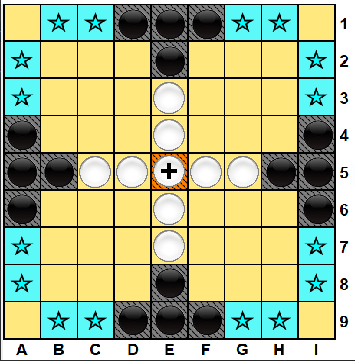
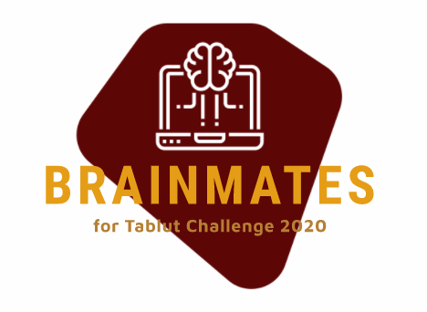

# :chess_pawn: Tablut Challenge 2020



**_Tablut_** is an ancient board game which was popular in nothern Europe and whose story is still uncertain.
The game board is grid of 9x9 squares where two players alternate in moving their checkers:
* attacker (black soldiers) 
* defender (white soldiers and one king)   

This repository contains an Java-based intelligent agent able to play to the game and it was designed to take part in the Tablut Students Challenge 2020 of the Fundamentals of Artificial Intelligence and Knowledge Representation course held at the University of Bologna.                   
The agent is based on one of the many versions of the rules for this game, known as "Ashton Tablut" (available in this [paper](http://ww.aagenielsen.dk/LinnaeusPaper-Longer.pdf)) and it interact with a Server maintained by dott. [Andrea Galassi](https://github.com/AGalassi/TablutCompetition).


## Setup

These instructions will get you a copy of the project up and running on your local machine for development and testing purposes.

### Download

First of all, you need to download the project through cloning.

```sh
git clone https://github.com/gmurro/Tablut.git
cd Tablut
```

### Requirements

You need to have JDK >= 8. From Ubuntu/Debian console, you can install it with these commands:
```sh
sudo apt update
sudo apt install openjdk-8-jdk -y
```

## Run

To launch the tool, you will simply move in `jars` directory and run the Server with:
```sh
java -jar Server.jar
```
Then you will run the artificial intelligent player with:
```sh
java -jar Client.jar <black|white> <timeout-in-seconds> <server-ip>
```


## Resources & Libraries

* Java 8 [API](https://docs.oracle.com/javase/8/docs/api/)


## Versioning

We use Git for versioning.

## Group
<p>

The name of group enrolled in the Tablut Students Challenge 2020 is **_brAInmates_**.
</p>


## Members

|  Name     |  Surname  |     Email                              |    Username      |
| :-------: | :-------: | :------------------------------------: | :--------------: |
| Giuseppe  | Murro     | `giuseppe.murro@studio.unibo.it`       | [_gmurro_](https://github.com/gmurro)         |
| Salvatore | Pisciotta | `salvatore.pisciotta2@studio.unibo.it` | [_SalvoPisciotta_](https://github.com/SalvoPisciotta) |
| Giuseppe  | Boezio    | `giuseppe.boezio@studio.unibo.it`      | [_giuseppeboezio_](https://github.com/giuseppeboezio) |


## License

This project is licensed under the MIT License - see the [LICENSE](LICENSE) file for details

